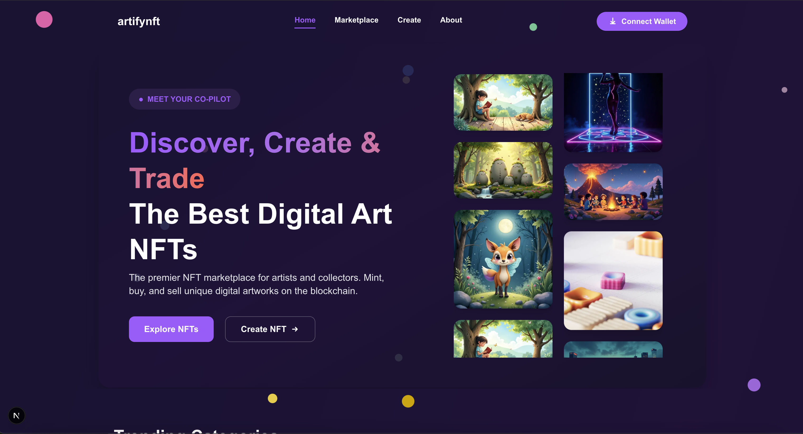
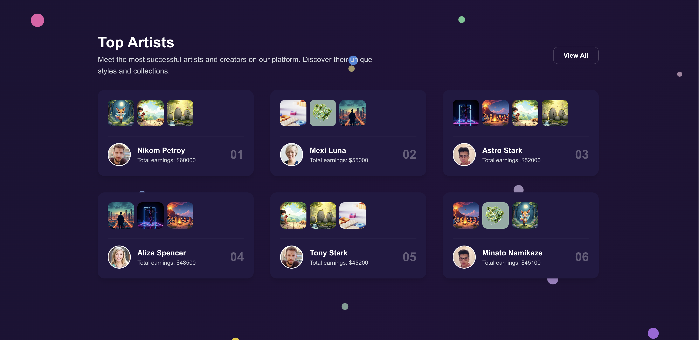
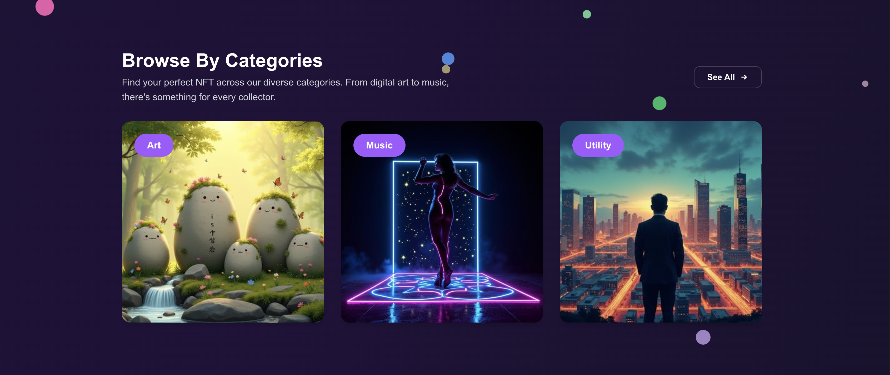
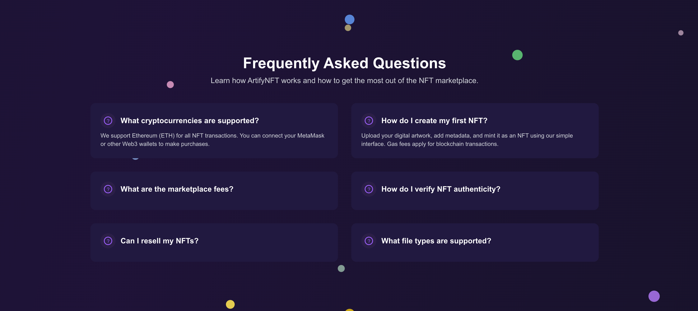
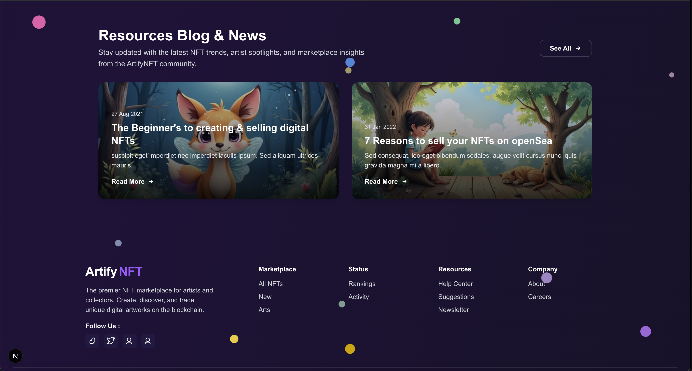

# ArtifyNFT - Premier NFT Marketplace

A modern, responsive NFT marketplace built with Next.js 15, React 19, and Tailwind CSS. ArtifyNFT provides a complete platform for artists and collectors to discover, create, and trade unique digital artworks on the blockchain.

## 📸 Screenshots

### Homepage

*The main landing page featuring the hero section with animated image slider and floating particles*

### Trending NFTs & Categories

*Browse trending NFTs and explore different categories with real-time bid information*

### Top Artists Showcase

*Discover top-performing artists and their collections with earnings statistics*

### Featured Collections

*Curated collections showcasing premium digital artworks from talented creators*

### Browse Categories

*Explore NFT categories including Art, Music, and Utility with stunning visual previews*

### FAQs Section

*Comprehensive FAQ section helping users understand NFT marketplace operations*

### Blog & Footer

*Latest blog posts and comprehensive footer with social links and navigation*

## 🚀 Features

### Core Functionality
- **NFT Marketplace**: Browse, buy, and sell digital artworks
- **Artist Profiles**: Showcase top artists and their collections
- **Wallet Integration**: Connect with MetaMask and other Web3 wallets
- **Real-time Bidding**: Live auction system with countdown timers
- **Category Browsing**: Organized NFT categories (Art, Music, Utility)

### User Experience
- **Responsive Design**: Optimized for desktop, tablet, and mobile
- **Parallax Effects**: Animated floating particles with scroll-based movement
- **Smooth Animations**: CSS animations and transitions throughout
- **Dark Theme**: Modern dark UI with purple accent colors
- **Interactive Elements**: Hover effects and micro-interactions

### Visual Design
- **Hero Section**: Animated image slider with vertical scrolling effect
- **Trending NFTs**: Grid layout with bid information and user avatars
- **Top Artists**: Showcase of successful creators with earnings
- **Featured Collections**: Curated gallery of premium artworks
- **How It Works**: Step-by-step guide for new users

## 🛠️ Technology Stack

### Frontend
- **Next.js 15**: React framework with App Router
- **React 19**: Latest React with concurrent features
- **TypeScript**: Type-safe JavaScript development
- **Tailwind CSS 4**: Utility-first CSS framework

### Development Tools
- **ESLint**: Code linting and formatting
- **PostCSS**: CSS processing
- **Node.js**: JavaScript runtime

### External Services
- **Stockcake Images**: High-quality stock photography
- **Pexels**: Additional image resources
- **RandomUser.me**: Avatar generation for demo purposes

## 📦 Installation

### Prerequisites
- Node.js 18+ 
- npm or yarn package manager

### Setup Instructions

1. **Clone the repository**
   ```bash
   git clone <repository-url>
   cd artifynft
   ```

2. **Install dependencies**
   ```bash
   npm install
   # or
   yarn install
   ```

3. **Run the development server**
   ```bash
   npm run dev
   # or
   yarn dev
   ```

4. **Open your browser**
   Navigate to [http://localhost:3000](http://localhost:3000)

## 🎨 Project Structure

```
artifynft/
├── src/
│   └── app/
│       ├── page.tsx          # Main landing page
│       ├── layout.tsx        # Root layout component
│       ├── globals.css       # Global styles
│       └── favicon.ico       # Site icon
├── screenshots/              # Application screenshots
│   ├── homepage.png          # Main landing page
│   ├── categories.png        # NFT categories section
│   ├── artists.png           # Top artists showcase
│   ├── collections.png       # Featured collections
│   ├── browse-categories.png # Category browsing section
│   ├── faqs.png             # FAQ section
│   └── blog-footer.png      # Blog posts and footer
├── public/                   # Static assets
├── package.json             # Dependencies and scripts
├── next.config.ts           # Next.js configuration
├── tailwind.config.js       # Tailwind CSS configuration
└── tsconfig.json            # TypeScript configuration
```

## 🎯 Key Components

### Hero Section
- Animated image slider with vertical scrolling
- Gradient text effects
- Call-to-action buttons
- Floating particles with parallax effect
- *See: Homepage screenshot above*

### Trending NFTs Grid
- Responsive card layout with 8 NFT cards
- Real-time bid information and ETH pricing
- User avatars and usernames
- Timer countdown for active auctions
- *See: Categories screenshot above*

### Top Artists Showcase
- Artist profile cards with sample artwork previews
- Earnings statistics and ranking system
- Portfolio preview with multiple NFT samples
- Professional artist profiles
- *See: Artists screenshot above*

### Featured Collections
- Curated gallery of premium artworks
- Grid layout showcasing diverse NFT styles
- High-quality image presentation
- Category-based organization
- *See: Collections screenshot above*

### Browse Categories
- Three main categories: Art, Music, and Utility
- Large visual previews with category labels
- Responsive grid layout
- Easy navigation between different NFT types
- *See: Browse Categories screenshot above*

### FAQ Section
- Comprehensive Q&A covering common NFT questions
- Clean card-based layout
- Categorized information for easy reference
- Helpful for new users and collectors
- *See: FAQs screenshot above*

### Blog & Footer
- Latest blog posts with featured images
- Social media integration
- Comprehensive footer navigation
- Contact information and legal links
- *See: Blog & Footer screenshot above*

### Interactive Elements
- Hover effects on cards and buttons
- Smooth transitions and animations
- Loading states and responsive navigation
- Parallax scrolling effects

## 🎨 Design System

### Color Palette
- **Primary**: `#a259ff` (Purple)
- **Secondary**: `#7c3aed` (Dark Purple)
- **Background**: `#1a1333` to `#18122b` (Gradient)
- **Cards**: `#231942` (Dark Purple)
- **Text**: White and gray variations

### Typography
- **Headings**: Bold, large scale
- **Body**: Regular weight, readable
- **Accents**: Gradient text effects

### Spacing
- Consistent padding and margins
- Responsive breakpoints
- Grid-based layouts

## 🚀 Deployment

### Build for Production
```bash
npm run build
# or
yarn build
```

### Start Production Server
```bash
npm start
# or
yarn start
```

### Environment Variables
Create a `.env.local` file for any environment-specific configurations:
```env
NEXT_PUBLIC_API_URL=your_api_url
NEXT_PUBLIC_CHAIN_ID=1
```

## 📱 Responsive Design

The application is fully responsive with breakpoints:
- **Mobile**: < 768px
- **Tablet**: 768px - 1024px
- **Desktop**: > 1024px

## 🎭 Animations

### CSS Animations
- **Floating Particles**: Continuous floating motion
- **Image Slider**: Vertical scrolling animations
- **Hover Effects**: Smooth transitions
- **Parallax**: Scroll-based particle movement

### Keyframes
- `slideUp`: Vertical upward movement
- `slideDown`: Vertical downward movement
- `floatSlow/Medium/Fast`: Floating animations

## 🔧 Configuration

### Next.js Config
External image domains are configured for:
- `images.stockcake.com`
- `images.pexels.com`
- `i.imgur.com`
- `images.unsplash.com`

### Tailwind CSS
Custom animations and utilities are defined in the global CSS file.

## 🤝 Contributing

1. Fork the repository
2. Create a feature branch (`git checkout -b feature/amazing-feature`)
3. Commit your changes (`git commit -m 'Add amazing feature'`)
4. Push to the branch (`git push origin feature/amazing-feature`)
5. Open a Pull Request

## 📄 License

This project is licensed under the MIT License - see the [LICENSE](LICENSE) file for details.

## 🙏 Acknowledgments

- **Stockcake**: High-quality stock images
- **Pexels**: Additional photography resources
- **RandomUser.me**: Avatar generation
- **Next.js Team**: Amazing React framework
- **Tailwind CSS**: Utility-first CSS framework

## 📞 Support

For support and questions:
- Create an issue in the repository
- Contact the development team
- Check the documentation

---

**ArtifyNFT** - Where Digital Art Meets Blockchain Technology 🎨✨
